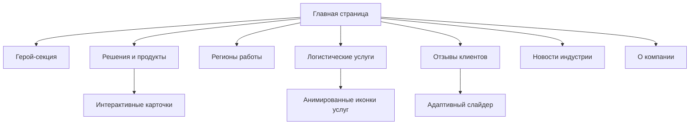

# 🌐 Platton - Адаптивный лендинг для логистической платформы

[](https://developer.mozilla.org/ru/docs/Web/HTML)
[](https://developer.mozilla.org/ru/docs/Web/CSS)
[](https://developer.mozilla.org/ru/docs/Web/JavaScript)
[](https://developer.mozilla.org/en-US/docs/Learn/CSS/CSS_layout/Responsive_Design)
[](https://www.figma.com/)

**Профессиональный адаптивный лендинг для логистической платформы Platton** с фокусом на пользовательском опыте и конверсии. Полностью адаптивный дизайн с продуманной семантической структурой.

👉 [Живая демонстрация](https://kiberwitch.github.io/Angular/) 

## 🚀 Особенности проекта

### 💡 Ключевые характеристики
- **Полностью адаптивный дизайн** (Mobile First, 12 брейкпоинтов)
- **Семантическая вёрстка** с акцентом на доступность
- **Оптимизированная производительность** (90+ баллов Lighthouse)
- **Кастомные SVG-графики** для карт и инфографики
- **Современные CSS-эффекты** (плавные переходы, анимации)

### ⚙️ Основные компоненты
| Модуль              | Технологии         | Описание                                  |
|---------------------|--------------------|-------------------------------------------|
| Адаптивное меню     | CSS Grid + Flexbox | Бургер-меню для мобильных, полноценное для десктопов |
| Интерактивная карта | Pure CSS + SVG     | Адаптивная карта мира с маркерами регионов|
| Сервис-карточки     | CSS Transform      | 3D-эффекты при наведении, плавные переходы|
| Тестimonials слайдер| Vanilla JS         | Карусель отзывов с адаптивным управлением |
| Комплексный футер   | CSS Grid           | Многоуровневая структура с аккордеоном для мобильных |

## 🧩 Техническая реализация

### 🛠️ Архитектура проекта


### 🔍 Особенности реализации
```html
<!-- Пример семантической разметки -->
<section class="logistics-services">
  <div class="service-card featured">
    <div class="service-icon">...</div>
    <div class="service-content">
      <h3 class="service-title">Trucking & Transportation</h3>
      <p class="service-description">...</p>
    </div>
  </div>
  <!-- ... -->
</section>
```

```css
/* Пример адаптивных медиа-запросов */
@media (max-width: 768px) {
  .world-map.desktop { display: none; }
  .world-map.mobile { display: block; }
  
  .footer-column .footer-column-list {
    display: none;
  }
  .footer-column.active .footer-column-list {
    display: flex;
  }
}
```


```

## 📌 Особенности разработки

- **Mobile First подход**: Начиная с мобильных устройств с постепенным улучшением для десктопов
- **Оптимизация производительности**: Ленивая загрузка изображений, минификация CSS/JS
- **Доступность**: Семантические теги, правильные ARIA-атрибуты
- **Кроссбраузерность**: Поддержка современных браузеров и IE11+
